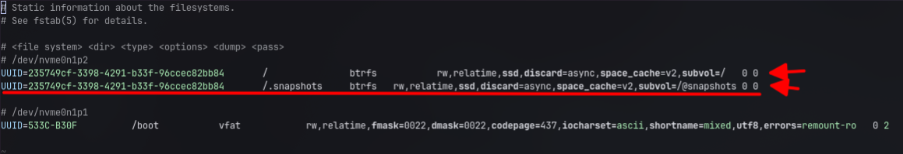
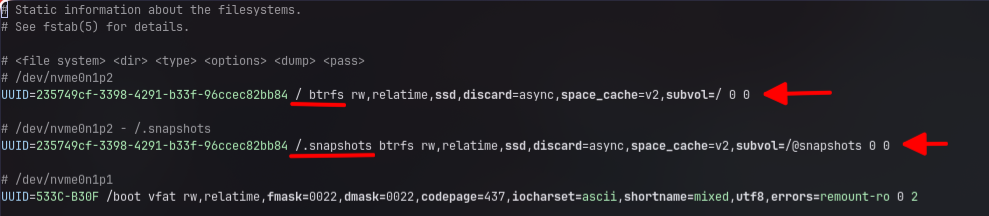

# Btrfs Snapshot Setup guide for Arch Linux (Fish Shell)

A simple **Btrfs Snapshot** system installation and setup guide for **Arch Linux** along with **Snapper**, **GRUB** and **Fish Shell**.

This system allows you to:
- Take snapshots with a few commands via Fish Shell (`arch snapshot`)
- Automatically create snapshots before and after system updates with `pacman`.
- Select Boot to past snapshots directly from the **GNU GRUB** page.

---

## Prerequisites

- Arch Linux operating system uses **Btrfs** as the Root File System (`/`)
- Use **GRUB** as Bootloader.
- Use **Fish Shell** as the main shell.

---

> [!WARNING]
> ## Important Notes & Warnings
> 
> <details><summary>Warning</summary>
> 
> ### 1. Prohibitions for Rollback (most important!)
> 
> - **Don't use** `snapper rollback` **directly from the base OS**:
> 
>   - On Arch Linux using the Btrfs subvolume (`@` and `/@snapshots`) layout, running the `snapper rollback` command directly while booting normally will result in the main subvolume crashing or a Kernel Panic on the next boot!
>   
>   - **How to Rollback Correctly**:
>   
>     1. Reboot the machine and select Boot into the desired Snapshot via **GRUB Menu** (`Arch Linux snapshots`).
>     
>     2. Once temporarily logged in via Snapshot, open Terminal and run the command:
>     
>       ```sh
>       sudo snapper rollback
>       ```
>       
>      1. Then reboot the machine again to return to the main system that has already rolled back.
> ---
> 
>  ### 2. Warning about lost files and data (**Data Loss Warning**)
>  
>  - **Rollback returns only Root** (`/`):
>  
>    - All Root Partition data (including Package, Configuration in `/etc`) will revert to the Snapshot date.
>    
>    - **If** `/home` **is not separated into a separate subvolume (for example,** `/home` **is included with** `/`**): all your personal files, documents, or desktop files will be sent back in time!**
>    
>    - **Tip**: Always backup important data in `/home` externally or separate Subvolume `@home` before running this script.
> ---
>    
>   ### 3. Disk space is full (Disk Space & Subvolume Maintenance)
>    
>  - **Deleting large files Doesn't help free up space immediately:**
>    
>    - On Btrfs if you delete large files in the system But the file is still saved in the old Snapshot. Disk space will not be regained.
>    
>    - If the disk is so full that Btrfs becomes Read-Only, delete the old Snapshot with the command:
>      ```sh
>      arch snapshot -d <ID_to be deleted>
>      ```
> ---
>    
>    ### 4. When Kernel or GRUB is updated
>    
>    - After a major system update (e.g. `pacman -Syu` with a Linux Kernel update), the `grub-btrfsd` service will automatically sync the Snapshots menu in GRUB.
>    
>    - If you opened GRUB and couldn't find the latest snapshot, you can manually create a new GRUB menu:
>      ```sh
>      sudo grub-mkconfig -o /boot/grub/grub.cfg
>      ```
> ---
> ### 5. Problem with `arch snapshot` function: can't find it.
> 
> - If you type `arch snapshot` and Shell says `command not found`:
> 
> - Check if the current user has **Fish Shell** enabled.
> 
> - Run the command to load the new config: `source ~/.config/fish/config.fish`
> 
>   ```sh
>   source ~/.config/fish/config.fish
>   ```
>   
>   - Check permissions of function file: `ls -l ~/.config/fish/functions/arch.fish` (must be Owner of that user)
> ---
> 
> </details>

## Installation Automated & (Step-by-Step)

<details><summary>Btrfs + Snapper Automated Setup for Arch Linux</summary>

## Btrfs + Snapper Automated Setup for Arch Linux

Script for automatically installing and configuring **Snapper**, **GRUB-Btrfs** and **Snap-Pac** on Arch Linux (**Btrfs**), with `arch snapshot` shortcut function for easily managing snapshots via Terminal.

### What's in this script?

1. **Auto-Detect Root Partition & UUID**: Automatically find the system Partition `/` and UUID.

2. **Package Installation**: Install `snapper`, `snap-pac`, `grub-btrfs` ready to use.

3. **Subvolume Setup**: Create and Mount Subvolume `/@snapshots` to `/.snapshots`.

4. **fstab Auto-Update**: Automatically add mount point `/.snapshots` to `/etc/fstab`.

5. **Snapper Configuration**: Set up Snapper for Config `root` (limit snapshots, hourly, daily, etc.)

6. **GRUB Integration**: Enable `grub-btrfsd` to automatically create a Boot Snapshot menu in GRUB.

7. **Custom Utility Function**: Install `arch snapshot` command for users (Fish Shell)

8. **Initial Backup**: Create the first snapshot of the system immediately after installation is complete.

### System requirements (Prerequisites)

* **OS**: Arch Linux
*  **FileSystem**: Btrfs On Root Partition (`/`)
* **Shell**: Fish Shell (for running the `arch snapshot` shortcut)
* **Bootloader**: GRUB

### How to use (Usage)

1. **Download** script

```sh
git clone https://github.com/KaiJu144/Snapper-Setup-Arch-Linux.git
cd Snapper-Setup-Arch-Linux
```

2. Set **permissions** for the script to run.

```sh
chmod +x install.fish
```

3. Run the script with `sudo`

```sh
sudo ./install.fish
```
---

</details>

## Installation Manually & (Step-by-Step)

<details><summary>Step 1: Install required packages</summary>

### Step 1: Install required packages

Open Terminal and install the core tools for Snapshot and GRUB integration:

```sh
sudo pacman -S snapper snap-pac grub-btrfs
```
---

</details>

<details><summary>Step 2: Prepare Btrfs Subvolume for Snapshots (@snapshots)</summary>

### Step 2: Prepare Btrfs Subvolume for Snapshots (`@snapshots`)

In order for Snapper and GRUB to work together without Permission or Resource Busy issues, a separate Subvolume must be created as follows:

 1. Create a Subvolume named @snapshots

```sh
sudo btrfs subvolume create /@snapshots
```

2. Create a folder for Mount

```sh
sudo mkdir -p /.snapshots
```

3. Mount Subvolume to /.snapshots (change /dev/nvme0n1p2 to your Partition Btrfs)

```sh
sudo mount -o subvol=@snapshots /dev/nvme0n1p2 /.snapshots
```

#### Add Auto-Mount settings to `/etc/fstab`:

Open the file `/etc/fstab` with a Text Editor:
- (e.g. `sudo nvim /etc/fstab` or `sudo nano /etc/fstab` or `sudo vim /etc/fstab` or `visudo /etc/fstab`)
-
  ```sh
  sudo nvim /etc/fstab
  ```
  
**or**

-
  ```sh
  sudo nano /etc/fstab
  ```
  
**or**

-
  ```sh
  sudo vim /etc/fstab
  ```
  
**or**

-
  ```sh
  visudo /etc/fstab
  ```

and **add the line below**:

```
UUID=<UUID-Of-Root-Partition> /.snapshots btrfs rw,relatime,ssd,discard=async,space_cache=v2,subvol=/@snapshots 0 0
```

(The **UUID** can be found from the line of `/` in the same fstab file.)


**Reload systemd** to **update fstab**:

```sh
sudo systemctl daemon-reload
```
```sh
sudo mount -a
```
---

</details>

<details><summary>Step 3: Set up Snapper Config (root)</summary>

### Step 3: Set up Snapper Config (`root`)

To prevent Config **stuck or errors**, create a Config file for Root (`/`) manually:

1. Create the file `/etc/snapper/configs/root`:
```sh
sudo mkdir -p /etc/snapper/configs
```

```sh
sudo nvim /etc/snapper/configs/root
```

2. Enter the **configuration** content as follows:

```
SUBVOLUME="/"
FSTYPE="btrfs"
SPACE_LIMIT="0.5"
FREE_LIMIT="0.2"
ALLOW_USERS=""
ALLOW_GROUPS=""
SYNC_ACL="no"
GENERATE_CLEANUP="yes"
NUMBER_CLEANUP="yes"
NUMBER_MIN_AGE="1800"
NUMBER_LIMIT="50"
NUMBER_LIMIT_IMPORTANT="10"
TIMELINE_CLEANUP="yes"
TIMELINE_MIN_AGE="1800"
TIMELINE_LIMIT_HOURLY="10"
TIMELINE_LIMIT_DAILY="10"
TIMELINE_LIMIT_WEEKLY="0"
TIMELINE_LIMIT_MONTHLY="0"
TIMELINE_LIMIT_YEARLY="0"
EMPTY_PRE_POST_CLEANUP="yes"
EMPTY_PRE_POST_MIN_AGE="1800"
```

3. Bind the name Config `root` to the Snapper system and set **permissions**:

```sh
echo "SNAPPER_CONFIGS=\"root\"" | sudo tee /etc/snapper/snapper-configs
```

```sh
sudo chmod 750 /.snapshots
```
---

</details>

<details><summary>Enable GRUB Snapshot Service.</summary>

### Step 4: Enable GRUB Snapshot Service.

Enable the `grub-btrfs` service to automatically find new snapshots and add them to the Boot menu:

```sh
sudo systemctl enable --now grub-btrfsd
```
---

</details>

<details><summary>Create a Custom Function arch snapshot in Fish Shell.</summary>

### Step 5: Create a Custom Function `arch snapshot` in Fish Shell.

Created functionality to facilitate snapshot management via Terminal:

1. Create a function file:
```sh
mkdir -p ~/.config/fish/functions
```

```sh
nvim ~/.config/fish/functions/arch.fish
```

2. Enter the Fish Script code below:

```sh
function arch --description "Arch Linux Snapshot Utility"
    set -l sub_command $argv[1]

    switch "$sub_command"
        case snapshot
            set -l flag $argv[2]
            set -l args $argv[3..-1]

            switch "$flag"
                case -l --list
                    echo " Listing all system snapshots..."
                    sudo snapper -c root list

                case -d --delete
                    if test (count $args) -eq 0
                        echo " Error: Please specify at least one snapshot ID to delete."
                        echo " Usage: arch snapshot -d <id1> [id2 id3 ...]"
                        return 1
                    end

                    echo " Deleting snapshot ID(s): $args..."
                    for id in $args
                        echo "   - Deleting ID: $id"
                        sudo snapper -c root delete $id
                    end

                    echo " Updating GRUB menu..."
                    sudo grub-mkconfig -o /boot/grub/grub.cfg

                case -h --help -help
                    echo " Arch Snapshot Utility"
                    echo "-------------------------------------"
                    echo "Usage:"
                    echo "  arch snapshot               : Create a manual snapshot"
                    echo "  arch snapshot -l            : List all snapshots"
                    echo "  arch snapshot -d <ID1> <ID2>: Delete multiple snapshots by ID"
                    echo "  arch snapshot -d (seq 1 15) : Delete snapshots from ID 1 to 15"
                    echo "  arch snapshot -h | -help    : Show this help message"

                case ""
                    set -l desc "Manual snapshot taken on "(date "+%Y-%m-%d %H:%M:%S")
                    echo " Creating manual snapshot..."
                    sudo snapper -c root create --description "$desc"
                    echo " Snapshot created successfully!"

                case "*"
                    echo " Unknown flag: $flag"
                    echo "Use 'arch snapshot -h' for help."
            end

        case "*"
            echo " Unknown command: $sub_command"
            echo "Use 'arch snapshot -h' for help."
    end
end
```

3. Load functions to use:

```sh
source ~/.config/fish/functions/arch.fish
```
---

</details>

# How to use (Usage)

### 1. Snapshot management command in Terminal (Fish Shell)

| command | Description |
|---|---|
| `arch snapshot` | Instantly **create a manual Snapshot** (with time/date stamp) |
| `arch snapshot -l` | **List all snapshots** in the system. |
| `arch snapshot -d <ID1> <ID2>` | **Delete multiple snapshots by ID** (e.g. `arch snapshot -d 5 6 7`) |
| `arch snapshot -d (seq <ID1> <ID15>)` | **Delete snapshots from ID** (e.g. `arch snapshot -d (seq 1 15)`) 
| `arch snapshot -h` | Show the [**Help menu**] (`arch snapshot -help`, `arch snapshot --help` can be used as well) |

### 2. Auto-Snapshot before-after system update

With `snap-pac` installed, **every time** you run the command:

```sh
sudo pacman -Syu
```

The system will **automatically** take `Pre` (before installation) and `Post` (after installation) snapshots.

### 3. Rollback (rewind the system when the device has a problem)

1. **Reboot** the machine and select the menu **`Arch Linux snapshots`** on the GNU GRUB page.

2. Select the **Snapshot** of the desired date and time.

3. When logging in (The system will temporarily be in a **Read-Only** state.) **If you are sure you want to roll back** the system, **open a Terminal and run**:

```sh
sudo snapper rollback
```

4. Order to **reboot** the machine again. The system will turn back time perfectly!

### 4. Customized Snapper settings (Default Retention)

This script sets up automatic snapshot retention to prevent the disk from filling up:

- Number Cleanup: **Keep up to 50 numbers** (10 important numbers)

- **Timeline Cleanup**:
  - Hourly: **Collect 10 characters**.
  - Daily: **Collect 10 characters**.
  - Weekly / Monthly / Yearly: **0** (`turn it off to save space`)

### 5. Troubleshooting steps to fully enable Overlayfs.

1. Add a hook to `mkinitcpio.conf`

- Open the `mkinitcpio.conf` file:

```sh
sudo nvim /etc/mkinitcpio.conf
```

```
HOOKS=(base udev autodetect microcode modprobed-db kms keyboard keymap consolefont block filesystems fsck grub-btrfs-overlayfs)
```

> [!NOTE]
> Look for the line `HOOKS=(...)` and add `grub-btrfs-overlayfs` at the end, after `fsck`
>
> 
> 
> ```
> HOOKS=(base udev autodetect microcode modprobed-db kms keyboard keymap consolefont block filesystems fsck grub-btrfs-overlayfs)
> ```

2. Configure GRUB-Btrfs snapshot kernel parameters.

Open `/etc/default/grub`:

```sh
sudo nvim /etc/default/grub
```

Set:

```ini
GRUB_BTRFS_SNAPSHOT_KERNEL_PARAMETERS="rd.live.overlay.overlayfs=1 snapper_snapshot_boot=1"
```

> [!IMPORTANT]
> The `snapper_snapshot_boot=1` parameter is used by the `systemd-remount-fs.service` fix below to identify snapshot boots. Keep it together with `rd.live.overlay.overlayfs=1`.

3. Create **initramfs** and update the **GRUB menu**.

- Run these commands to customize the Kernel Boot Image and create a new Boot menu:

```sh
sudo mkinitcpio -P
```

```sh
sudo grub-mkconfig -o /boot/grub/grub.cfg
```

---


### 6. Fix `systemd-remount-fs.service` FAILED when booting a GRUB-Btrfs snapshot

> [!IMPORTANT]
> If snapshot boot works but `systemctl --failed` shows:
>
> ```text
> systemd-remount-fs.service
> ```
>
> with an error similar to:
>
> ```text
> mount: /: fsconfig() failed: overlay: No changes allowed in reconfigure.
> ```
>
> this can happen because `grub-btrfs-overlayfs` changes `/` into an OverlayFS during snapshot boot, while `systemd-remount-fs.service` later tries to remount `/` according to the normal Btrfs `/etc/fstab` entry.
>
> The fix below makes `systemd-remount-fs.service` run normally on the main system, but skip itself when the kernel command line contains `snapper_snapshot_boot=1` (the flag used by the snapshot boot).

#### 6.1 Add a systemd drop-in

**Run this while booted into the normal/main Arch Linux system, NOT while booted into a snapshot.**

Create the drop-in directory:

```sh
sudo mkdir -p /etc/systemd/system/systemd-remount-fs.service.d
```

Create the configuration. The following command works in **Fish Shell** as well:

```sh
sudo sh -c 'printf "%s\n" "[Unit]" "ConditionKernelCommandLine=!snapper_snapshot_boot=1" > /etc/systemd/system/systemd-remount-fs.service.d/snapshot-overlay.conf'
```

Verify it:

```sh
cat /etc/systemd/system/systemd-remount-fs.service.d/snapshot-overlay.conf
```

It must contain:

```ini
[Unit]
ConditionKernelCommandLine=!snapper_snapshot_boot=1
```

Reload systemd:

```sh
sudo systemctl daemon-reload
```

#### 6.2 Verify the drop-in on the normal system

While still booted normally:

```sh
cat /proc/cmdline
```

The normal boot should **not** contain:

```text
snapper_snapshot_boot=1
```

Then check:

```sh
systemctl status systemd-remount-fs.service --no-pager
```

The service should remain able to run normally on the Btrfs root filesystem.

You can also verify that systemd sees the condition:

```sh
systemctl cat systemd-remount-fs.service
```

The output should include:

```ini
/etc/systemd/system/systemd-remount-fs.service.d/snapshot-overlay.conf

[Unit]
ConditionKernelCommandLine=!snapper_snapshot_boot=1
```

#### 6.3 Create a NEW snapshot after applying the fix

> [!WARNING]
> Snapshots created **before** this drop-in was added do not automatically contain the new file. Create a new snapshot after applying the fix and boot that new snapshot for the test.

Create a snapshot:

```sh
sudo snapper create --description "Test overlay remount fix"
```

List snapshots:

```sh
arch snapshot -l
```

Note the new snapshot ID.

#### 6.4 Boot the NEW snapshot from GRUB

Reboot and select:

```text
Arch Linux snapshots
```

Then select the snapshot created **after** the fix.

After logging in, verify:

```sh
cat /proc/cmdline
```

It should contain:

```text
snapper_snapshot_boot=1
```

Verify that `/` is OverlayFS:

```sh
findmnt /
```

Expected type:

```text
overlay
```

Finally:

```sh
systemctl --failed
```

Expected result:

```text
0 loaded units listed.
```

`systemd-remount-fs.service` should no longer appear as FAILED.

#### 6.5 Why this works

Normal boot:

```text
normal boot
    ↓
no snapper_snapshot_boot=1
    ↓
ConditionKernelCommandLine=!snapper_snapshot_boot=1 → TRUE
    ↓
systemd-remount-fs.service runs normally
```

Snapshot boot:

```text
GRUB-Btrfs snapshot boot
    ↓
snapper_snapshot_boot=1
    ↓
grub-btrfs-overlayfs creates /
    ↓
ConditionKernelCommandLine=!snapper_snapshot_boot=1 → FALSE
    ↓
systemd-remount-fs.service is skipped
    ↓
no OverlayFS reconfigure/remount failure
```

This fix is specifically for the OverlayFS snapshot-boot path. It does **not** change the normal `/etc/fstab` Btrfs root configuration.

> [!NOTE]
> This procedure was tested with Arch Linux, `systemd 261`, `grub-btrfs`, `snapper`, and the `grub-btrfs-overlayfs` mkinitcpio hook. Exact behavior can differ with other bootloaders, initramfs systems, systemd versions, or customized filesystem layouts, so this should not be treated as a universal guarantee for every Arch installation.

## OPTIONAL

<details><summary>How to clean and reset Snapper to #1</summary>

### Why does Snapper not reuse the old snapshot number after I delete it? (In-depth explanation)

- There are three main factors that prevent Snapper from resetting to `#1` after we delete files:
1. `info.xml` within **Subvolume** (`/.snapshots/<number>/info.xml`):
Snapper doesn't just check if the folder in `/.snapshots/ exists`, every time a snapshot is created, it creates an `info.xml` file to store metadata. If these files are stuck or the numbers in the XML conflict, the system will skip to the next number.

2. **Snapper Internal DB / Metadata Counter**:
The Snapper Engine stores the Next Snapshot ID in Memory/State. If you delete a folder using `rm -rf` without using the `snapper delete` command, the Snapper counter will not update backward.

3. **Btrfs Subvolume Tree Inconsistency**:
At the Btrfs File System level, each subvolume has its own subvolume ID in the kernel. Even if the folder is deleted on the OS, if the actual subvolume hasn't been `btrfs subvolume delete`, the snapper will consider that area to still have a conflict and will run the next ID to prevent data overlap (Data Corruption Protection).

#### How to clean and reset Snapper #1 (One-Liner / Single Script)

> [!WARNING]
> ## YOU NEED TO DELETE ALL YOUR SNAPSHOT BEFORE PROCEEDING WITH THE FOLLOWING STEPS.

- To completely reset the Snapper system to a clean 100% reset, returning the snapshot count to `#1` you can use the command/script below:

1. **Stop the service** and **unmount all** old files.

```sh
sudo systemctl stop grub-btrfsd
```

```sh
sudo umount -l /.snapshots 2>/dev/null
```

```sh
sudo rm -rf /.snapshots
```

```sh
sudo rm -rf /etc/snapper/configs/*
```

2. Unlock the **configuration** to allow **Snapper** to create a new configuration.

```sh
echo 'SNAPPER_CONFIGS=""' | sudo tee /etc/conf.d/snapper >/dev/null
```

```sh
echo 'SNAPPER_CONFIGS=""' | sudo tee /etc/sysconfig/snapper >/dev/null
```

3. Let **Snapper** create the actual **configuration** file first (it will secretly create its own `/.snapshots` file).

```sh
sudo snapper -c root create-config /
```

4. Swap the `/.snapshots` that **Snapper** creates with our actual `@snapshots`.

```sh
sudo umount /.snapshots 2>/dev/null
```

```sh
sudo rm -rf /.snapshots
```

```sh
sudo mkdir -p /.snapshots
```

```sh
sudo mount -o subvol=@snapshots (df -P / | tail -n1 | awk '{print $1}') /.snapshots
```

5. Register the **configuration** and set **permissions**.

```sh
echo 'SNAPPER_CONFIGS="root"' | sudo tee /etc/conf.d/snapper >/dev/null
```

```sh
echo 'SNAPPER_CONFIGS="root"' | sudo tee /etc/sysconfig/snapper >/dev/null
```

```sh
sudo chmod 750 /.snapshots
```

6. **Restart Service**.

```sh
sudo systemctl daemon-reload
```

```sh
sudo systemctl restart grub-btrfsd
```
### 5.5 Ensure Persistent Mounts (`/etc/fstab`)

> [!NOTE]
> To prevent snapshots from disappearing after a system **reboot**, ensure your `/@snapshots` subvolume is registered in `/etc/fstab`.

1. Open the `/etc/fstab` file.

```sh
sudo nvim /etc/fstab
```

**or**

```sh
sudo nano /etc/fstab
```

2. Add this line to the bottom of the file.

> [!NOTE]
> If you find multiple duplicate `/.snapshots` lines, delete them all so that only one remains, in this correct format.



```sh
UUID=YOUR_ROOT_UUID  /.snapshots  btrfs  rw,relatime,ssd,discard=async,space_cache=v2,subvol=/@snapshots  0 0
```

> [!NOTE]
> (Replace `YOUR_ROOT_UUID` with the actual UUID of your primary drive.)

> [!TIP]
> (The complete `/etc/fstab` file after adding this will look like this.)
> ```sh
> # Static information about the filesystems.
> # See fstab(5) for details.
> 
> # <file system> <dir> <type> <options> <dump> <pass>
> # /dev/nvme0n1p2
> UUID=235749cf-3398-4291-b33f-96ccec82bb84 / btrfs rw,relatime,ssd,discard=async,space_cache=v2,subvol=/ 0 0
> 
> # /dev/nvme0n1p1
> UUID=533C-B30F /boot vfat rw,relatime,fmask=0022,dmask=0022,codepage=437,iocharset=ascii,shortname=mixed,utf8,errors=remount-ro 0 2
>
> # /dev/nvme0n1p2 - /.snapshots
> UUID=235749cf-3398-4291-b33f-96ccec82bb84 /.snapshots btrfs rw,relatime,ssd,discard=async,space_cache=v2,subvol=/@snapshots 0 0
> ```

3. Perform a **mount** test and **reload** Systemd.

- Run this command in the **Terminal** to **mount the system** immediately without **restarting**

```sh
sudo systemctl daemon-reload
```

```sh
sudo mount -a
```

#### All your snapshots will reappear immediately, and this time, they won't disappear even after multiple restarts.

</details>

---